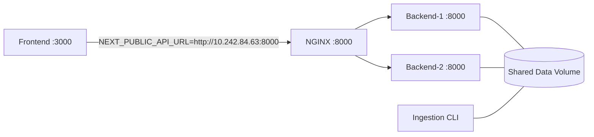

# Docker Deployment and Architecture

## Overview
This repository contains three modules and a shared data store:
- Backend (FastAPI) — CPU-heavy ICASA generation and Zarr reads
- Frontend (Next.js) — Visualization UI on port 3000
- Ingestion pipeline (CLI) — Bootstrap and incremental data ingestion
- Data store — Zarr and intermediate data under `data/` (>200GB)

The deployment runs all modules with Docker and supports:
- Multiple backend instances behind an NGINX load balancer
- Frontend fixed at `http://10.242.84.63:3000`
- API proxied at `http://10.242.84.63:8000`
- Shared data volume between ingestion and backend

## Architecture


- NGINX load balances requests to two backend containers (Least Connections)
- Both backend instances and the ingestion service mount the same data volume to access the Zarr store
- The Zarr path is configurable via `ZARR_PATH` for the backend and `CHIRPS_*_DIR` for ingestion

## Data Strategy (>200GB)
- By default, `docker-compose.yml` defines a named volume `chirps-data` mounted at `/data` (backend) and `/app/data` (ingestion)
- To reuse your existing on-disk data without copying, bind mount the host path by uncommenting the `driver_opts` in `docker-compose.yml` and set `device` to your absolute `data` directory path
- Backend uses `ZARR_PATH=/data/zarr/chirps_v3.0_daily_precip_v1.0.zarr` (configurable)
- Ingestion uses `CHIRPS_ZARR_DIR=/app/data/zarr` and the same store name

## Scaling and Performance
- Backend container starts Gunicorn with Uvicorn workers; adjust `GUNICORN_WORKERS` per container to utilize CPU cores
- Alternatively scale containers: `docker compose up --scale backend-1=1 --scale backend-2=1` or add more services similarly
- Tune per-container CPU/memory limits in compose under `deploy.resources`
- Backend parallelism can be tuned via env:
  - `MAX_WORKERS` (empty = auto)
  - `USE_PROCESSES` (true/false)
  - Zarr chunk sizes: `ZARR_TIME_CHUNKS`, `ZARR_LAT_CHUNKS`, `ZARR_LON_CHUNKS`

## Configuration
- Frontend: `NEXT_PUBLIC_API_URL` must point to the load balancer (default `http://10.242.84.63:8000`)
- Backend: `ZARR_PATH` points to the mounted Zarr path (default in compose `/data/zarr/...`)
- Ingestion: `CHIRPS_*` env vars set base and data dirs

## Build and Run

### Build all images
```bash
docker compose build
```

### Run the stack
```bash
docker compose up -d
```

- Access frontend at: http://10.242.84.63:3000
- API load balancer at: http://10.242.84.63:8000

### Use ingestion
- Inspect current store:
```bash
docker compose run --rm ingestion info
```
- Run auto mode (bootstrap or incremental):
```bash
docker compose run --rm ingestion auto -y
```

## Autostart & Scheduling (macOS)

Two options are provided:
- System-wide LaunchDaemons (recommended): run at boot without user login.
- Per-user LaunchAgents (legacy): run only after a specific user logs in.

1) Create logs dir if missing:
```bash
mkdir -p logs
```

### Recommended: System LaunchDaemons (no user login required)

Install to run at boot and for all users. Requires admin rights.

```bash
sudo install -m 0755 deploy/macos/system/wait-for-docker.sh /usr/local/bin/wait-for-docker.sh
sudo sed -e 's#deploy/macos/system/wait-for-docker.sh#/usr/local/bin/wait-for-docker.sh#g' \
  deploy/macos/system/com.ufchirpszarr.compose.autostart.daemon.plist | sudo tee /Library/LaunchDaemons/com.ufchirpszarr.compose.autostart.plist >/dev/null
sudo sed -e 's#deploy/macos/system/wait-for-docker.sh#/usr/local/bin/wait-for-docker.sh#g' \
  deploy/macos/system/com.ufchirpszarr.ingest.daily.daemon.plist | sudo tee /Library/LaunchDaemons/com.ufchirpszarr.ingest.daily.plist >/dev/null

sudo launchctl load -w /Library/LaunchDaemons/com.ufchirpszarr.compose.autostart.plist
sudo launchctl load -w /Library/LaunchDaemons/com.ufchirpszarr.ingest.daily.plist

# Verify
sudo launchctl list | grep ufchirpszarr || true
```

Manage/Remove:
```bash
sudo launchctl unload -w /Library/LaunchDaemons/com.ufchirpszarr.compose.autostart.plist
sudo launchctl unload -w /Library/LaunchDaemons/com.ufchirpszarr.ingest.daily.plist
sudo rm -f /Library/LaunchDaemons/com.ufchirpszarr.compose.autostart.plist \
            /Library/LaunchDaemons/com.ufchirpszarr.ingest.daily.plist
```

Notes:
- These daemons wait for Docker to be ready before running commands.
- Ensure Docker Desktop is configured to start at login, or run Docker engine as a service; otherwise the wait may time out.
- Update hardcoded repo path in the plists if your checkout path differs.
- Adjust the daily schedule via `StartCalendarInterval` values.

### Legacy: Per-user LaunchAgents (only after login)

If you prefer user-scoped agents, use the plist files in `deploy/macos/` and follow the earlier steps.

## Notes
- Ensure the host firewall allows inbound 3000 and 8000 on 10.242.84.63
- If running on a different host/IP, keep port 3000 published on that host to preserve shared URL; update DNS or announcments accordingly
- Logs from backend are mounted to `backend/logs`

## Troubleshooting
- Backend error "Zarr store not found": verify `ZARR_PATH` and the data volume binding
- Performance issues: increase `GUNICORN_WORKERS`, add more backend containers, or set `USE_PROCESSES=true` and `MAX_WORKERS` appropriately
